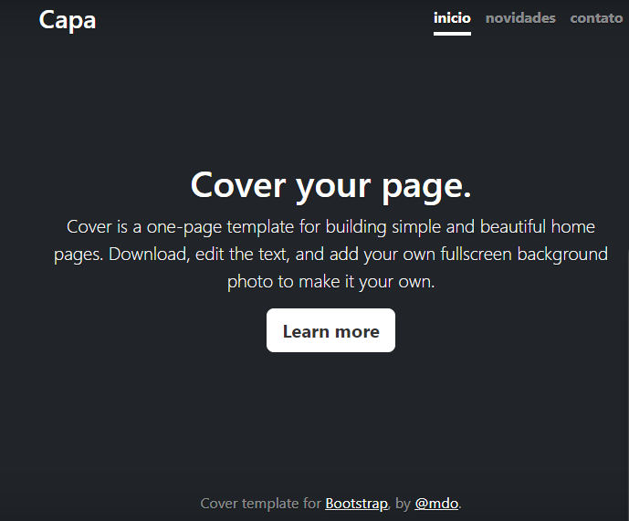

# indice

* [Projeto escrita do READNE](#projeto-escrita-do-readme)
* [descrição](#descrição)
* [introdução](#introdução)
* [funcionalidades](#funcionalidades)
* [tecnologia utilizadas](#tecnologia-utilizadas)
* [fontes utilizadas](#fontes-utilizadas)
* [autores](#autores)

# Projeto escrita do README

## descrição

## introdução

## funcionalidades

### tecnologia utilizadas

## fontes utilizadas

## autores